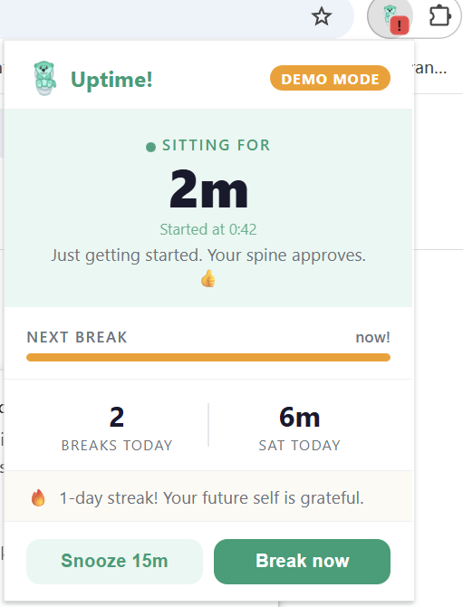
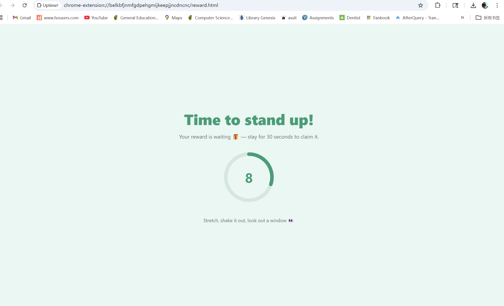
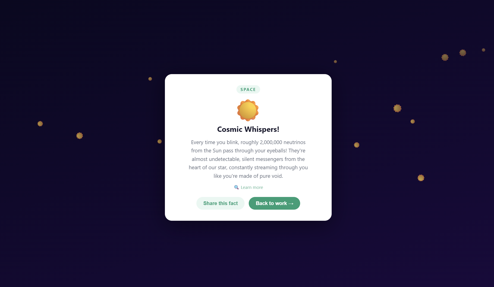
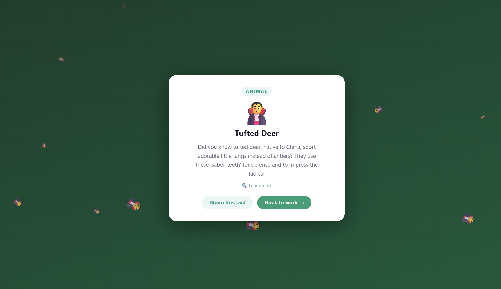

# Uptime! 🦦

> **Smart sitting reminder that makes taking breaks feel rewarding.**

[](https://chromewebstore.google.com/detail/njcmdjognknhffkhbfcpcdbedofomhkf)

**[➜ Install from the Chrome Web Store](https://chromewebstore.google.com/detail/njcmdjognknhffkhbfcpcdbedofomhkf)**

Instead of annoying popups you dismiss, every completed break unlocks a surprise **AI-generated reward** — fun animal facts, space trivia, weird history, counterintuitive science, or a completely fictional study. The catch: you don't see the reward until *after* you stand up and wait 30 seconds.

- 🌐 **Landing page:** https://uptime-landing-page-tawny.vercel.app
- 🎬 **Demo video:** https://www.youtube.com/watch?v=PwIlvkM06zw
- 🏆 **Originally built for BroncoHack 2026** — Sport & Fitness / Health & Wellness track


---

## Screenshots

| Popup — Live Timer | Countdown Screen |
|---|---|
|  |  |

| Reward Reveal | Themed Background |
|---|---|
|  |  |

---

## Features

### Smart Sitting Timer
- Automatically starts tracking when Chrome launches or you return from idle
- Pauses the timer after **5 minutes of no keyboard/mouse input** — idle time is never counted against you
- Resets daily at midnight; all stats are stored locally via `chrome.storage`

### Break Reminders That Respect Your Flow
- Default break reminder fires every **45 minutes** of active sitting
- **Never interrupts during meetings** — detects Google Meet, Zoom, and Teams and waits
- **Never interrupts when you're in flow** — rapid tab switching (3+ tabs in 30 seconds) delays the reminder by 5 minutes
- If you close the break screen early, the reminder comes back in **5 minutes** — no silent failures

### AI-Generated Rewards (Google Gemini 2.5 Flash)
Each completed break reveals one of five reward types, picked randomly so you never get the same category twice in a row:

| Type | Description |
|---|---|
| 🐾 **ANIMAL** | A surprising micro-fact about an obscure or cute animal |
| 🌌 **SPACE** | A mind-bending fact that makes reality feel strange |
| 📜 **HISTORY** | A genuinely weird fact almost nobody knows |
| ⚗️ **SCIENCE** | A counterintuitive fact that sounds fake but is real |
| 🧪 **FAKE STUDY** | A completely made-up but plausible-sounding scientific study |

- 5 hardcoded fallback rewards ensure the demo always works, even without internet
- Last successful API response is cached as an extra safety net

### Reward Reveal Screen
- Opens as a new tab when break time arrives
- **30-second countdown** with an animated SVG ring — you must stay on the tab to claim the reward
- Closing the tab early forfeits the reward and streak credit (intentional — no cheating)
- After countdown: **card flip animation** reveals the fact
- **Themed background gradient** shifts based on reward category (deep purple for SPACE, forest green for ANIMAL, amber for HISTORY, etc.)
- **Floating emoji particles** matching the reward drift upward like themed confetti
- **"Learn more"** button opens a Google search for the fact (hidden for fictional studies)
- **"Share this fact"** copies the reward text to clipboard

### Popup — Live Dashboard
- **Live session timer** updates every second — shows `23m` or `1h 8m` format
- **Pulsing green dot** confirms the timer is actively running
- **"Started at 2:34 PM"** shows exactly when the current session began
- **Progress bar** toward next break turns orange at 80%, driven by real alarm schedule
- **Today's stats**: breaks completed + total sitting time
- **Streak counter**: consecutive days with at least one completed break
- **Cheeky copy** that escalates in urgency as sitting time grows
- Otter mascot icon **tints orange → red** as sitting duration increases (30 min / 60 min thresholds)

### Icon Badge
- Shows **minutes remaining** until the next break directly on the toolbar icon
- Hidden when > 10 minutes remain — the otter icon stays clean
- Color-coded: green (6–10 min) → orange (1–5 min) → red `!` (break overdue)
- Updates immediately after snooze or break completion

### System Notifications
- A native Chrome notification fires **5 minutes before** break time
- *"Finish your thought. A fun fact is waiting for you."*

### Snooze — One Per Session
- **"Snooze 15m"** delays the next break by 15 minutes
- Limited to **one snooze per session** — after use, the button turns grey with *"You need this break 😅"*
- Resets after every completed break

### Demo Mode
- Click the **logo 3 times within 2 seconds** to toggle Demo Mode
- Sets the sitting threshold to **2 minutes** so judges can see the full flow without waiting 45 minutes
- An orange **DEMO MODE** badge appears in the popup header
- Toggle again to return to normal

### Site Category Detection (`content.js`)
The extension classifies every tab you visit and adjusts behavior accordingly:

| Category | Sites | Behavior |
|---|---|---|
| `meetings` | Google Meet, Zoom, Teams | Never interrupts |
| `coding` | GitHub, localhost, Stack Overflow, CodePen | Normal |
| `video` | YouTube, Netflix, Twitch | Normal |
| `reading` | Notion, Docs, Medium, Wikipedia | Normal |
| `other` | Everything else | Normal |

The site category is also passed to Gemini to add context to the reward prompt.

---

## File Structure

```
uptime-extension/
├── manifest.json        Chrome extension manifest (MV3)
├── background.js        Service worker: timer, alarms, idle detection, badge
├── content.js           Injected script: site category + typing pause detection
├── api.js               Reward queue logic — calls the Cloudflare Worker proxy
├── popup.html           Extension popup UI
├── popup.js             Popup logic: live timer, stats, snooze, demo mode
├── popup.css            Popup styles
├── reward.html          Break screen: countdown + reward reveal
├── reward.js            Reward logic: countdown, flip animation, particles
├── reward.css           Reward styles: themes, card flip, particles
├── collection.html      Collection page
├── collection.js        Collection page logic
├── icons/
│   ├── icon16.png       Toolbar icon (16×16)
│   ├── icon48.png       Extensions page icon (48×48)
│   └── icon128.png      Install screen icon (128×128)
├── worker/
│   ├── index.js         Cloudflare Worker — Gemini API proxy with rate limiting
│   └── wrangler.toml    Cloudflare deployment config
└── screenshots/
    ├── demo1.png
    ├── demo2.png
    ├── demo3.png
    └── demo4.png
```

---

## How to Run

### Prerequisites
- Google Chrome (version 88 or later)

### Setup

**1. Clone the repository**
```bash
git clone https://github.com/OniKiely/Uptime-_BroncoHack2026Project.git
cd Uptime-_BroncoHack2026Project
```

**2. Load the extension in Chrome**

1. Open Chrome and navigate to `chrome://extensions`
2. Toggle **Developer mode** ON (top-right corner)
3. Click **Load unpacked**
4. Select the project folder (`Uptime-_BroncoHack2026Project/`)
5. The Uptime! otter icon will appear in your Chrome toolbar

> No API key setup required. AI rewards are fetched through a serverless proxy — the key is stored securely on the server side.

### Testing the Full Flow

**Normal mode** — sit for 45 minutes, then the break screen opens automatically.

**Demo mode** — for quick testing:
1. Click the Uptime! toolbar icon to open the popup
2. Click the **otter logo 3 times quickly** — the orange `DEMO MODE` badge appears
3. Wait **2 minutes** — the reward screen opens automatically
4. Stay on the tab for 30 seconds to claim your reward
5. Click the logo 3 times again to return to normal mode

### Reloading After Code Changes
1. Go to `chrome://extensions`
2. Click the **refresh icon** on the Uptime! card
3. For `background.js` changes, also click **"Service Worker"** to open its DevTools

---

## Tech Stack

| Layer | Technology |
|---|---|
| Extension | Chrome Manifest V3 |
| Language | Vanilla JavaScript (no frameworks) |
| AI | Google Gemini 2.5 Flash (`gemini-2.5-flash`) |
| API proxy | Cloudflare Workers (serverless, free tier) |
| Storage | `chrome.storage.local` |
| Scheduling | `chrome.alarms` |
| Idle detection | `chrome.idle` |
| Styling | Pure CSS (no UI libraries) |

---

## Team

| Name | Responsibilities |
|---|---|
| **Ruiyang (Wendy)** | timer logic, idle detection, Chrome APIs, badge, notifications, Logo design |
| **Oisin** | UI/UX, animations, Quality Assurance, Demo video |

---

## Known Limitations

- The extension icon badge requires Chrome 88+ (`chrome.action` API)
- Idle detection threshold is 5 minutes — shorter periods of inactivity still count as sitting time
- AI rewards require an internet connection; 5 offline fallback facts are shown if the proxy is unreachable
